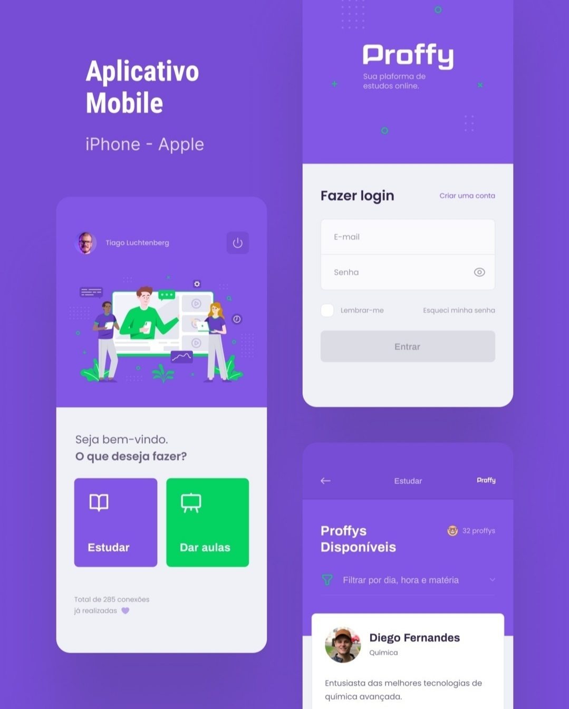

<h1>
  
</h1>

[](https://github.com/roperes98/NLW-2-mobile/blob/master/LICENSE)


<h1>
    
</h1>

## 📚 Indice
- [Sobre](#-sobre)
- [Tecnologias utilizadas](#-tecnologias-utilizadas)
- [Como baixar o projeto](#-como-baixar-o-projeto)

⠀⠀⠀⠀⠀⠀⠀⠀

---

⠀⠀⠀⠀⠀⠀⠀⠀

## 🔖 Sobre

O projeto Proffy é um app que visa a conexão entre professores e alunos para a realização de aulas particulares, onde foram praticados diversos conceitos de react native.

⠀⠀⠀⠀⠀⠀⠀⠀
## 🚀 Tecnologias utilizadas

O projeto foi desenvolvido utilizando as seguintes tecnologias:

- [React Native](https://reactnative.dev)
- [typescript](https://www.typescriptlang.org)
- [Styled components](https://styled-components.com)

⠀⠀⠀⠀⠀⠀⠀⠀

## 🗂 Como baixar o projeto

```bash

  # Clonar o repositório
  $ git clone https://github.com/roperes98/NLW-2-mobile.git

  # Entrar no diretório
  $ cd NLW-2-mobile

  # instalar as dependências
  $ yarn install

  # Iniciar o projeto
  $ yarn start

```
⠀⠀⠀⠀⠀⠀⠀⠀

---
⠀⠀⠀⠀⠀⠀⠀⠀<br>
Desenvolvido por Rodrigo Peres! 👾
